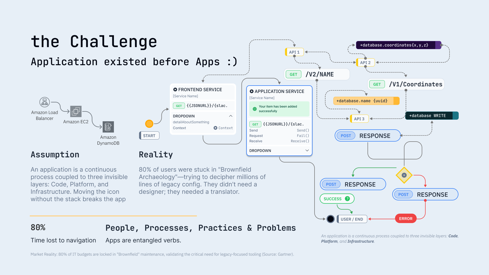
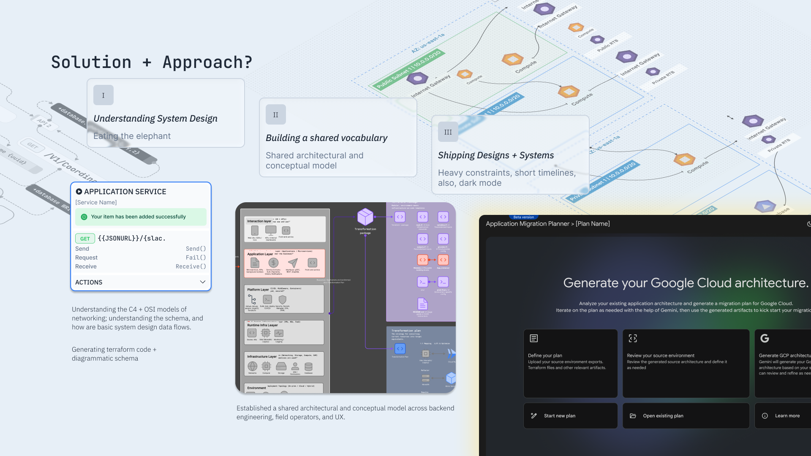
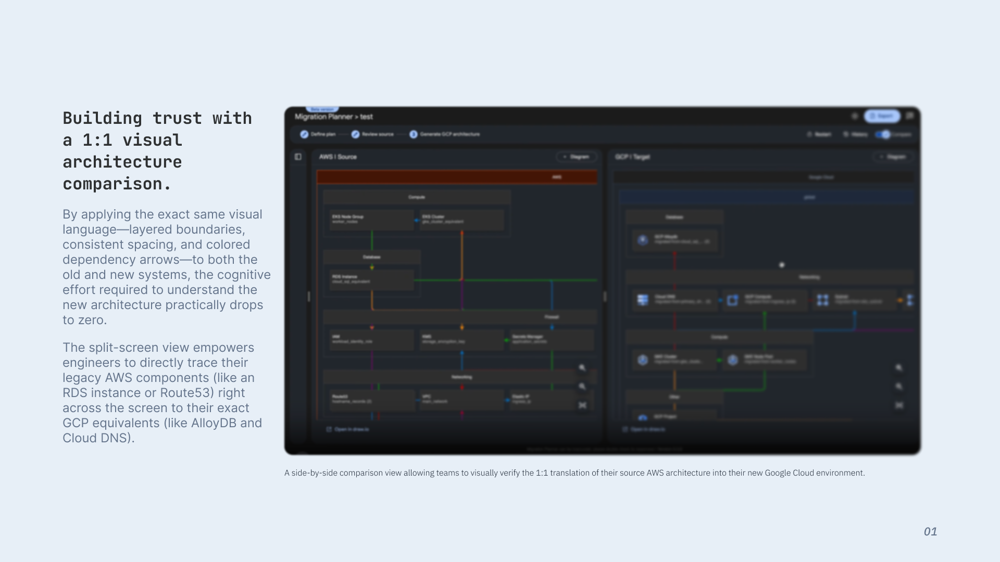
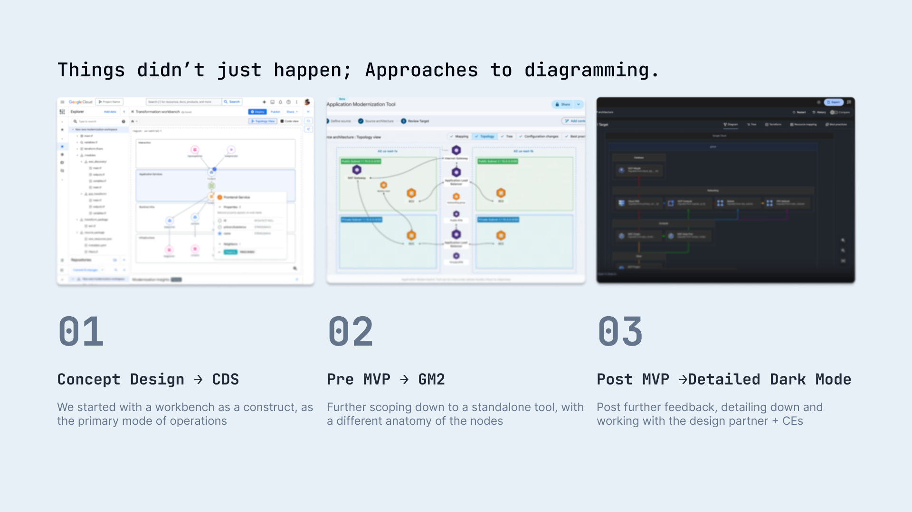
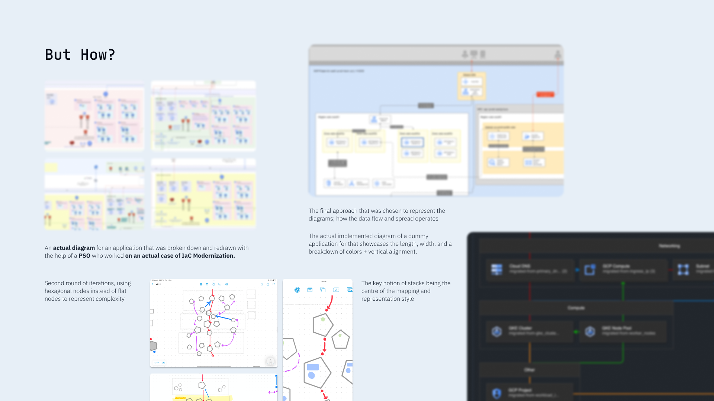
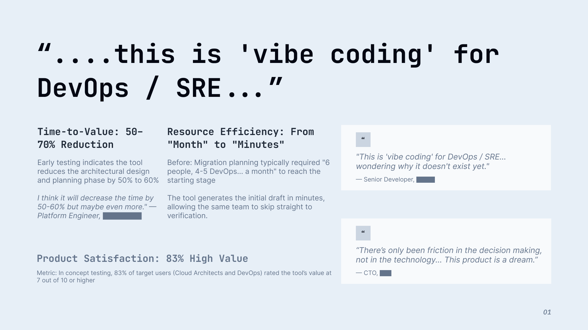

## Context: brownfield migration is a wicked problem

Enterprise developers were spending roughly **40% of their time** navigating complex system architectures without adequate visualization tools. Brownfield application migration is inherently “wicked”: the legacy estate is incomplete, politically loaded, and still changing while you plan the move.

Industry-wide, manual discovery for enterprise migration often consumes **months**; automation can compress discovery to **under 72 hours**[^discovery]. Yet **about 70% of cloud migrations stall or fail** when teams lack a faithful picture of the current legacy state[^stall]. **Most IT budgets** remain tied to brownfield maintenance[^budget]—so tooling that respects legacy reality is not a side quest; it is the main market.

## Product outcome

We enabled a **net-new Planner application** that made **brownfield enterprise migration tractable for the first time**, directly addressing the large majority of customers who operate in **legacy, non-greenfield** environments (not the small slice on a clean-slate path).

## What exists now?

**Product and technical direction**

- **Gen AI–assisted path to deployable infrastructure:** We leveraged generative AI to automate and help refactor complex brownfield enterprise applications into **deployable Terraform**, shrinking the gap between “what runs today” and “what we can safely express as code.”

**How UX shaped product reality**

- **Defined shared vocabulary and system schema** so engineering, field, and design could reason about the same objects and states.
- **Shaped foundational architecture** so the product could grow without re-litigating first principles on every milestone.
- **Unlocked cross-team decision-making** by making trade-offs visible early—especially where legacy constraints, risk, and sequencing conflicted.
- **Co-owned frontend implementation and visualization stress-testing:** I contributed directly to UI delivery, co-designing **scalable components and schemas** with engineering and **stress-testing** views against real enterprise topologies.
- **Established a shared architectural and conceptual model** across backend engineering, field operators, and UX so execution stayed aligned when the domain was noisy and ambiguous.

*Roughly how legacy complexity shows up before you can name it: real systems rarely look like the clean diagrams in slide decks.*

We delivered this capability **on aggressive timelines** with a **lean, senior-heavy team**, consistently hitting critical milestones despite **high domain and technical uncertainty**.

## How did we solve for it?

  <article class="case-solution-card" role="listitem">
    
Understanding system design

  </article>
  <article class="case-solution-card" role="listitem">
    
Eating the elephant

  </article>
  <article class="case-solution-card" role="listitem">
    
Building a shared vocabulary

  </article>
  <article class="case-solution-card" role="listitem">
    
Shared architectural and conceptual model

  </article>
  <article class="case-solution-card" role="listitem">
    
Shipping designs + systems

  </article>
  <article class="case-solution-card" role="listitem">
    
Heavy constraints, short timelines—also, dark mode

  </article>

*Solution & approach: from tangled legacy to something teams could execute against.*

{}
**Heads up:** the **UI shots here are mocks**—they show the *idea*, not literal shipping screens. The real story is under **NDA**; I’m only including what’s already **public**.
{}

## Example: trust through a side-by-side you can read

**Same visual language on both sides**—same box style, spacing, and arrows—so you’re not decoding two different diagrams.

**Split screen:** you can trace something on the left (say **RDS** or **Route 53** on AWS) straight across to what it maps to on the right (**AlloyDB**, **Cloud DNS** on GCP). *Names are just examples to show the pattern.*

The slide looks easy. **It isn’t.** The hard part is everything around the picture—messy data, edge cases, people, time.

  
  

*More mock explorations—same “how,” different slices of the problem.*

## Impact

In practice, the Planner work shortened the distance between “we think we know the estate” and “we can commit to a plan”—for design partners, that showed up as fewer review cycles, clearer handoffs to engineering, and migration conversations that stayed grounded in evidence instead of slides.



[^discovery]: *Industry context:* Manual discovery for enterprise migration typically consumes 3–6 months; automation can reduce this to under 72 hours. Source: AWS / CloudSphere.

[^stall]: *Problem scope:* Roughly 70% of cloud migrations stall or fail due to incomplete understanding of the current legacy estate. Source: McKinsey / EPI-USE.

[^budget]: *Market reality:* About 80% of IT budgets are locked in brownfield maintenance, which validates the need for legacy-focused tooling. Source: Gartner.
