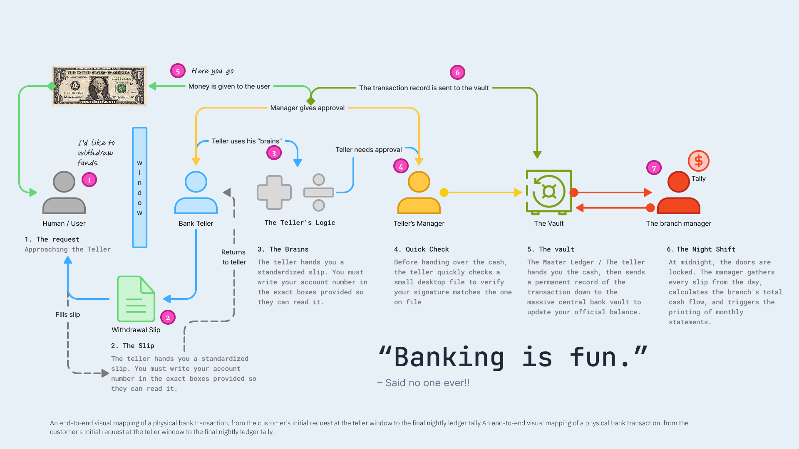
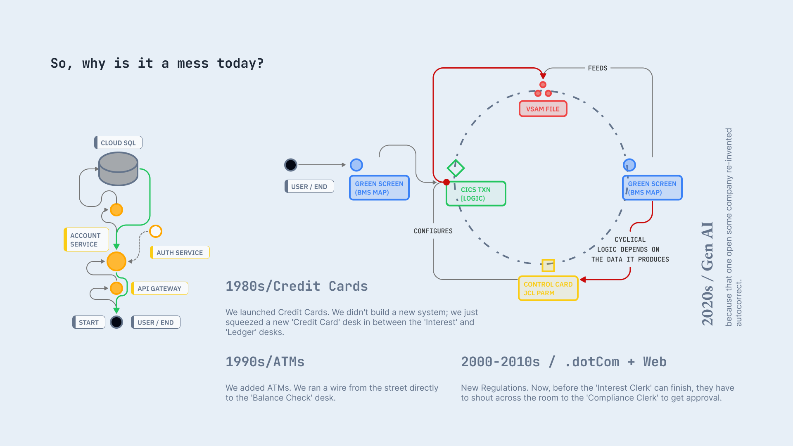
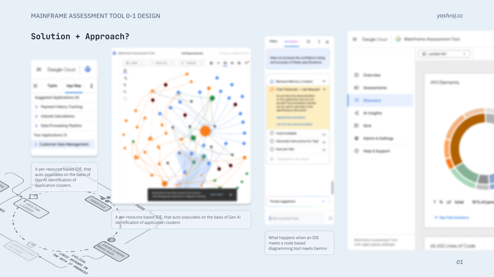
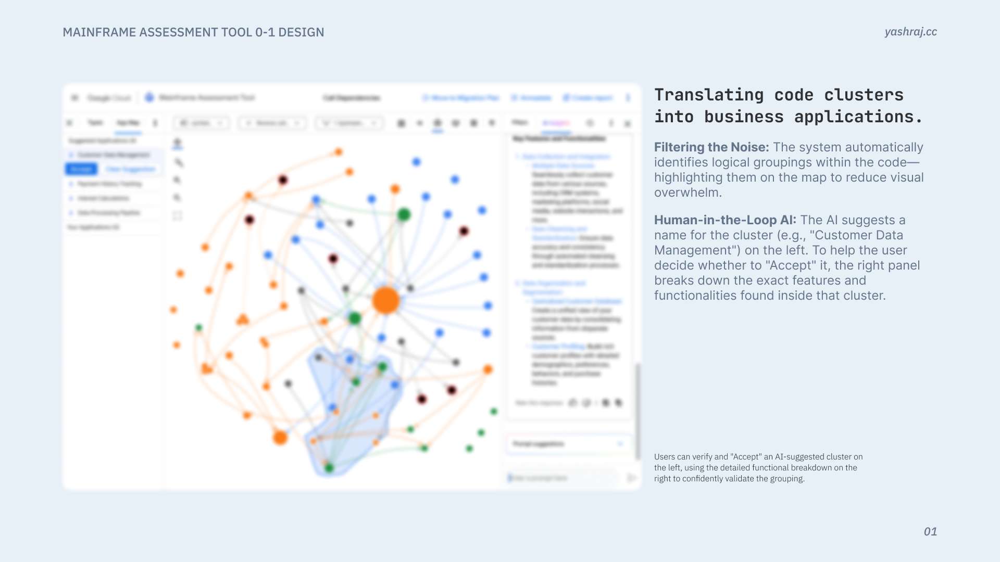
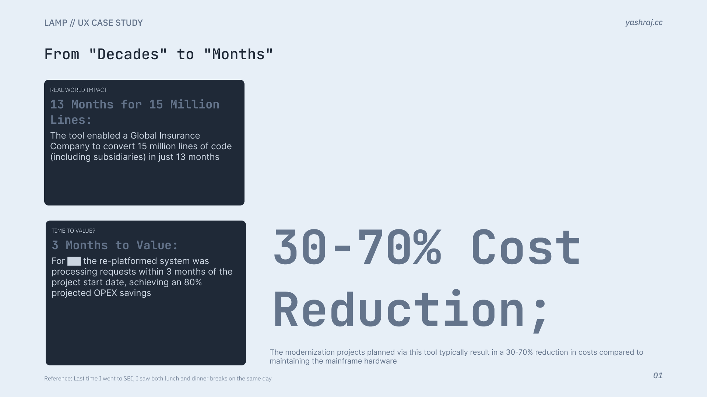

## What this work was about

**Mainframe Assessment Tool (MAT)** was hard to explain because the real system is huge and old. My job was to **cut through the noise**: make the product legible for people who need to **decide**, not just admire diagrams.

{}
**Public page:** Names, screens, and numbers here are **generic or mocked**. The story is real; customer detail is not.
{}

## The barrier

Modernizing a mainframe stack is **so heavy** that teams stall. Without a shared picture, every meeting replays the same fears instead of moving work forward.

## Taking the program on

The effort had **many ideas pulling in different directions**. I stepped in when a senior staff designer left and **ran design end to end**—from framing to delivery—so the program did not lose a year re‑negotiating “what MAT is.”

In **about eight weeks**, that work settled into a **framework we could ship**: priorities, patterns, and language the whole team could reuse.

## The question behind the UI

> Most of the risk sits **under the waterline**: years of dependencies, exceptions, and habits nobody wrote down. **How do you show decades of legacy** so a developer today can **migrate without guessing**?

That is not a chart problem. It is a **trust** problem. The interface had to respect how big the iceberg really is.

To explain that trust chain to stakeholders, we used a **plain-world parallel**: a withdrawal at a branch. It is familiar, sequential, and every step has a clear owner—much easier to reason about than “the mainframe” in the abstract.

*End-to-end map of a physical withdrawal: who asks, who formats the request, who checks it, and where the record finally lives.*

**You are the customer** with a simple intent: *I want my money.* **The teller** is the product surface—friendly, bounded, trained. **The teller’s “brains”** are the quick checks: signature on file, rules, exceptions. **The manager** is governance when the case is unusual. **The vault** is the system of record: the balance that actually matters after the day is done. **The night shift** is the slow truth—batch tally, statements, the ledger catching up so tomorrow starts clean.

That is the same shape as assessment: a **standardized slip** (structured inputs), **visible checks** (signals vs guesses), **escalation** when risk spikes, and a **durable record** so engineering and finance agree on what happened.

*Same story with roles named: who holds the intent, who applies judgment, and where authority and memory split.*

**Scope grew from two journeys to six**, each owned end to end:

- Overview  
- Discovery  
- AI insights  
- Settings  
- Reports  
- Filtering  

> “We went from a few scattered flows to **one story** we could walk customers through. That made reviews and builds calmer for everyone.”  
> **— Senior developer, team lead**

## Approach

**Idea:** Work **one resource at a time**. The diagram shows the shape; clicking a node opens a small **IDE-style** panel for that item.

**Gen AI** suggests **application clusters** and **pre-fills** fields. You **review and edit**—nothing ships on auto-pilot.

**Prompt we kept repeating:** *IDE + node diagram + Gemini — on one screen.*

*Mock UI, not a shipping screen.*

## Example: code clusters → business applications

The system **finds logical groupings in the code** and **highlights them on the map** so the graph is easier to read instead of one unreadable blob—that is the “filter the noise” step. On the **left**, the model proposes a **plain-English cluster name** (for example, “Customer Data Management”); on the **right**, a **feature-level breakdown** lists what was actually found inside that cluster so you are not accepting a label blind. **Accept** is a deliberate step: you are turning **tacit, scattered knowledge** into **named things everyone can point to**, which builds a **shared baseline of what exists** before planning or migration work moves on.

## Impact

Teams could **point at the same plan**, expand the surface without losing the plot, and **unblock decisions** that used to drown in complexity.

*Representative impact framing (mock).*

**Role over this period:** UX Designer II → Lead UX Designer.


